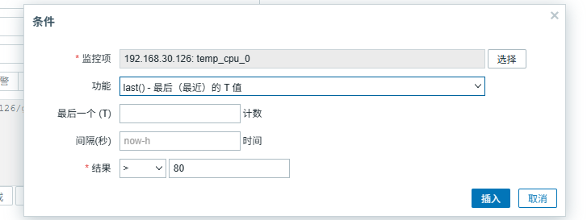

> zabbix 版本6.4.21
>
> 以监控温度为例

## 配置监控项

1. 在agent端配置文件中添加如下配置

    ```ini
    # /etc/zabbix/zabbix_agentd.conf
    UserParameter=get_temp_cpu[*],sensors|grep "Package id $1"|cut -c 17-20
    ```

    保存后重启zabbix-agent

2. 在Web页面添加监控项

    数据采集 -> 主机 -> 监控项 ->  创建监控项

    键值就是在agent配置文件中的get_temp_cpu

    

## 配置触发器

数据采集 -> 主机 -> 触发器 ->  创建触发器


表达式可以通过页面中**表达式构造器**来生成


通过页面选择后会自动生成表达式，然后点击测试按钮，测试是否能触发



## 配置邮箱告警

### 配置触发器动作

告警 -> 动作 -> 触发器动作 -> 创建动作


然后点击操作

这里操作是指告警时要做的行为，恢复操作是指问题恢复后的行为

点击编辑，可以看到如下页面

其中步骤 `1-0` 是指从告警到恢复的过程， 步骤持续时间是指这个过程中间隔多少时间操作一次，比如1800秒发送邮件一次。

下面可以自定义发送的内容，也可以根据媒介中配置的模板自动生成，媒介配置在后面。


### 配置媒介

告警 -> 媒介 -> 创建媒介类型


根据自己的邮箱进行配置

一般服务器地址和端口会在你使用的邮箱设置中能看到

用户名称即邮箱地址

通常需要自己去开启邮箱的SMTP功能，然后生成授权码，填入下面的密码中。


在消息模板中配置对应类型的消息模板，我这里配置了两个，一个在告警时发送，一个在告警恢复时发送通知。

点击添加会自动生成通用模板，也可以自己定义，这里需要注意html语法的换行，如果去掉html标签，会导致邮件内容显示成一行。


如果触发器有多个值可以通过如下形式获取

```html
<br>{ITEM.NAME1} = {ITEM.VALUE1}</br>
<br>{ITEM.NAME2} = {ITEM.VALUE2}</br>
```

### 配置用户

告警 -> 用户

这里我们就使用默认的Admin进行邮件发送


在报警媒介中添加收件人，填写email地址即可


